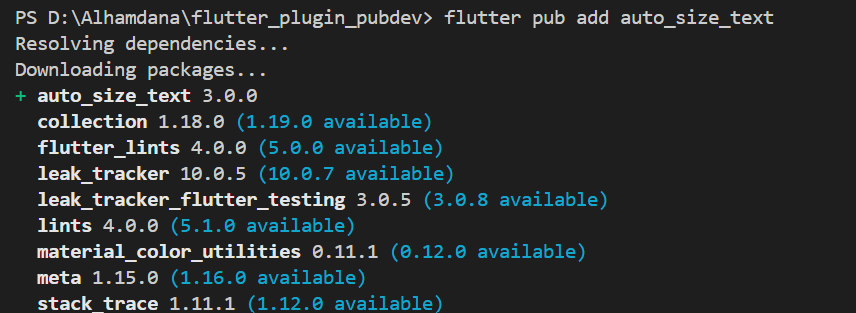
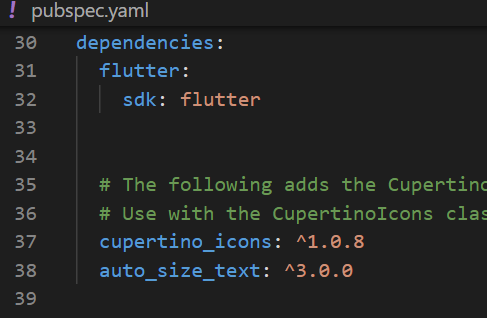
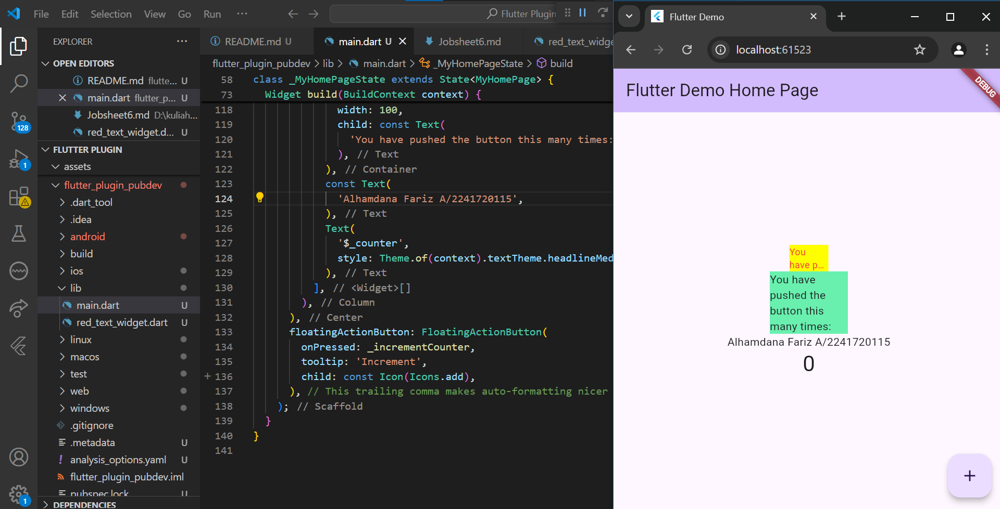

# #07 | Manajemen Plugin

1. Langkah 1: Buat Project Baru

2. Langkah 2: Menambahkan Plugin





3. Langkah 3: Buat file red_text_widget.dart
```dart
import 'package:flutter/material.dart';

class RedTextWidget extends StatelessWidget {
  const RedTextWidget({Key? key}) : super(key: key);

  @override
  Widget build(BuildContext context) {
    return Container();
  }
}
```
4. Langkah 4: Tambah Widget AutoSizeText
```dart
return AutoSizeText(
      text,
      style: const TextStyle(color: Colors.red, fontSize: 14),
      maxLines: 2,
      overflow: TextOverflow.ellipsis,
);
```
- Terjadi eror dikarenakan tidak diketahuinya variabel text, sehingga diperlukan pembuatan variabel text

5. Langkah 5: Buat Variabel text dan parameter di constructor

```dart
final String text;

const RedTextWidget({Key? key, required this.text}) : super(key: key);
```
6. Langkah 6: Tambahkan widget di main.dart
```dart
children: <Widget>[
    Container(
        color: Colors.yellowAccent,
        width: 50,
        child: const RedTextWidget(
        text: 'You have pushed the button this many times:'
        ),
    ),
    Container(
        color: Colors.greenAccent,
        width: 100,
        child: const Text(
        'You have pushed the button this many times:',
        ),
    ),
]
```

## Tampilan Hasil Program



## Tugas Praktikum
1. Selesaikan Praktikum tersebut, lalu dokumentasikan dan push ke repository Anda berupa screenshot hasil pekerjaan beserta penjelasannya di file README.md!
2. Jelaskan maksud dari langkah 2 pada praktikum tersebut!
- Pada langkah ini, plugin auto_size_text ditambahkan ke proyek Flutter menggunakan perintah flutter pub add auto_size_text di terminal. Plugin ini memungkinkan teks untuk menyesuaikan ukurannya secara otomatis agar sesuai dengan batas ruang yang tersedia, sehingga teks dapat ditampilkan dengan rapi. Jika perintah ini berhasil, nama plugin beserta versinya akan secara otomatis ditambahkan di bagian dependencies di file pubspec.yaml.
3. Jelaskan maksud dari langkah 5 pada praktikum tersebut!
- Pada langkah ini, variabel text ditambahkan ke dalam RedTextWidget, yang merupakan widget kustom. Variabel ini bertipe String dan disertakan sebagai parameter wajib (required) dalam konstruktor widget, yang berarti setiap kali RedTextWidget dipanggil, nilai teks harus disediakan. Konstruktor ini juga memanggil super(key: key) yang digunakan untuk meneruskan key ke konstruktor widget dasar (superclass). Dengan menambahkan variabel text dan parameter ini, widget dapat menerima dan menampilkan teks dinamis yang dikirim dari luar saat widget digunakan dalam aplikasi.
4. ada langkah 6 terdapat dua widget yang ditambahkan, jelaskan fungsi dan perbedaannya!
- Fungsi
    > Widget 1 (RedTextWidget)\
    Container ini memberikan warna latar belakang yellowAccent dengan lebar 50 piksel, dan menampilkan widget kustom RedTextWidget yang berisi teks. Teks ini merupakan bagian dari widget kustom yang sebelumnya didefinisikan, yang mungkin memiliki gaya teks tersendiri (seperti warna merah, sesuai dengan namanya).

    > Widget 2 (Text)\
    Container ini memberikan warna latar belakang greenAccent dengan lebar 100 piksel, dan menampilkan widget bawaan Text yang berisi teks statis tanpa ada penyesuaian gaya tambahan.
- Perbedaan\
Text merupakan widget standar Flutter yang hanya menampilkan teks tanpa pengaturan tambahan. Sementara RedTextWidget merupakan widget kustom yang memungkinkan kita untuk menentukan gaya teks secara khusus, seperti warna atau ukuran.
5. Jelaskan maksud dari tiap parameter yang ada di dalam plugin auto_size_text berdasarkan tautan pada dokumentasi ini !
- key: Parameter ini digunakan untuk mengontrol bagaimana satu widget dapat menggantikan widget lain di dalam pohon widget Flutter.
- textKey: Berfungsi untuk menetapkan kunci (key) bagi widget Text yang dihasilkan. Kunci ini dapat digunakan untuk mengidentifikasi widget tertentu dalam koleksi atau daftar widget yang serupa, dan membantu Flutter dalam mengelola perubahan atau update pada widget tersebut.
- style: Parameter ini memungkinkan pengguna untuk menentukan gaya teks, seperti warna, ukuran font, ketebalan, dan dekorasi. Jika nilai style tidak null, maka gaya ini akan diterapkan pada teks. Contoh penggunaan: Anda dapat membuat teks tebal, miring, atau mengubah warnanya dengan menggunakan TextStyle yang didefinisikan di parameter ini.
- minFontSize: Menentukan batas ukuran teks minimum yang akan digunakan saat teks menyesuaikan ukuran secara otomatis (auto-sizing). Jika ruang yang tersedia terbatas, ukuran teks akan diperkecil, namun tidak akan lebih kecil dari minFontSize ini.
- maxFontSize: Menentukan batas ukuran teks maksimum yang akan digunakan ketika teks menyesuaikan ukurannya secara otomatis. Ini memastikan bahwa teks tidak akan menjadi terlalu besar dan melebihi ukuran maksimum yang ditentukan.
- stepGranularity: Mengatur ukuran langkah dalam penyesuaian ukuran font. Misalnya, jika stepGranularity diatur ke 2, maka ukuran teks akan meningkat atau menurun dalam langkah-langkah 2 piksel. Ini menentukan seberapa halus atau kasar perubahan ukuran font saat menyesuaikan teks.
- presetFontSizes: Merupakan daftar ukuran font yang telah ditentukan sebelumnya yang bisa dipilih untuk teks. Daftar ini harus dalam urutan menurun (dari ukuran terbesar ke terkecil). Ketika digunakan, ukuran teks hanya akan disesuaikan berdasarkan nilai-nilai yang ada di daftar ini, mengabaikan minFontSize dan maxFontSize.
- group: Parameter ini digunakan untuk mensinkronkan ukuran teks antara beberapa widget AutoSizeText. Ini memungkinkan beberapa teks di lokasi yang berbeda dalam UI untuk tetap memiliki ukuran yang sama, yang berguna ketika tampilan yang seragam di berbagai bagian layar dibutuhkan.
- textAlign: Menentukan bagaimana teks harus disejajarkan secara horizontal di dalam batas widget. Misalnya, Anda dapat mengatur teks untuk disejajarkan ke kiri, tengah, kanan, atau disesuaikan secara rata (justify).
- textDirection: Mengontrol arah dari teks, apakah harus diurutkan dari kiri ke kanan atau dari kanan ke kiri.
- locale: Digunakan untuk memilih font yang tepat ketika satu karakter Unicode dapat dirender secara berbeda tergantung pada lokal (bahasa dan wilayah).
- softWrap: Parameter ini mengontrol apakah teks harus dipisahkan atau dibungkus pada batas-batas baris lunak (soft line breaks). Jika true, teks akan dipisahkan saat mencapai batas lebar; jika false, teks akan ditampilkan pada satu baris tanpa mempedulikan lebarnya.
- wrapWords: Menentukan apakah kata-kata yang tidak muat dalam satu baris harus dipisah ke baris berikutnya. Jika diatur ke true (default), kata yang panjang akan dipindahkan ke baris berikutnya. Jika false, kata panjang akan ditampilkan di baris yang sama, yang bisa menyebabkan overflow.
- overflow: Mengatur bagaimana penanganan visual jika teks meluap melebihi batas yang disediakan. Ada beberapa opsi seperti clip (memotong teks), ellipsis (menambahkan titik-titik di akhir teks yang terpotong), atau fade (membuat teks perlahan memudar).
- overflowReplacement: Jika teks meluap dan tidak muat di dalam batas yang tersedia, widget ini akan ditampilkan sebagai pengganti teks yang meluap. Ini dapat berguna untuk menampilkan pesan atau tampilan lain ketika konten teks tidak cukup ruang.
- textScaleFactor: Mengontrol skala teks, yang secara langsung mempengaruhi ukuran teks berdasarkan faktor skala tertentu.
- maxLines: Menentukan jumlah maksimum baris yang bisa digunakan untuk menampilkan teks. Jika jumlah baris teks melebihi maxLines, teks akan dipotong atau di-truncate sesuai pengaturan overflow yang ditentukan.
- semanticsLabel: Label semantik alternatif untuk teks, yang berguna untuk tujuan aksesibilitas. 